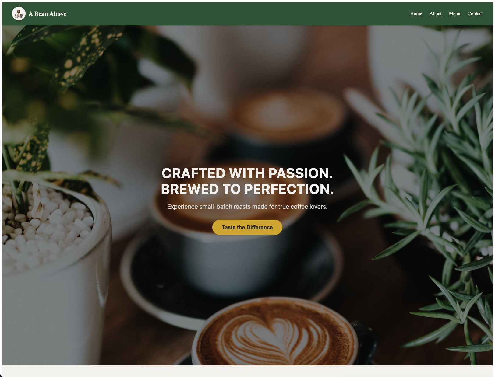
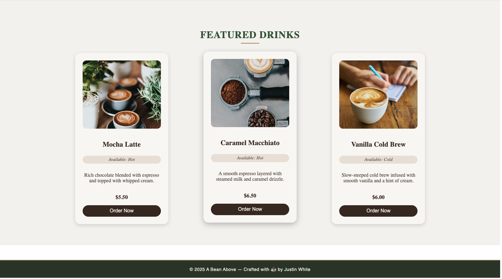
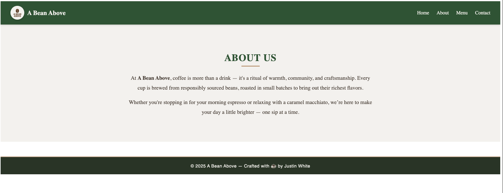
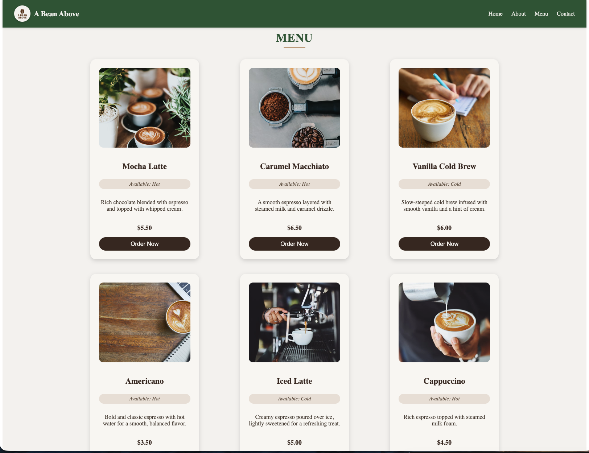
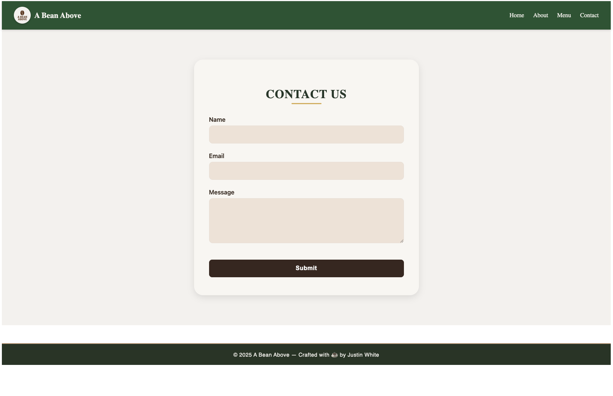

# CoffeeShop

CoffeeShop is a compact single-page React app that demonstrates component composition, client-side routing, and responsive layout. The repository is intentionally small and easy to review.

## Tech stack

- React (v19)
- React Router (v7)
- Vite (dev & build tooling)
- Plain CSS for styles

## Highlights

- Component-first structure: small, reusable UI components in `src/components/` for easy composition and reuse.
- Routing & page structure: lightweight route wiring in `src/App.jsx` with clear separation between pages and components.
- Practical CSS: small, focused CSS files organized per component/page for predictable layout and responsive behavior.
- Dev setup: Vite for fast local feedback and a simple build/preview flow.

## Quick start

Install dependencies and run the dev server:

```bash
npm install
npm run dev

```

Open [http://localhost:5173/] in your browser

## Future Improvements

- Add shopping cart functionality
- Filter menu by hot/cold drinks
- Add animations and transitions
- Connect to a backend API
- Add user authentication

## Screenshots

Below are example screenshots from the running app.










